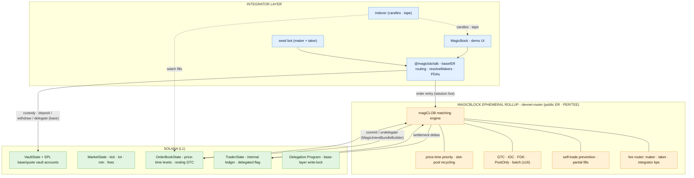

# magiCLOB (`magiclob`)

**An Open, MEV-Resistant, High-Frequency Liquidity Layer Built on Solana & Magicblock Ephemeral Rollups**

---

## Executive Overview

**magiCLOB** is a Central Limit Order Book (CLOB) designed as open liquidity infrastructure for [Solana](https://solana.com). Inspired by wholesale liquidity engines like [Sui](https://sui.io)'s [DeepBook](https://deepbook.tech), it acts as a shared, programmatically accessible matching backend that any DEX, algorithmic trading bot, or mobile app can integrate.

Leveraging **Magicblock Ephemeral Rollups (ERs)**, magiCLOB executes a CLOB outside the 400ms Solana slot schedule while collateral stays locked in Solana PDAs:

* **Latency:** Order placement, matching, cancellation, and modification execute on an Ephemeral Rollup, bypassing the base-layer slot schedule for the duration of a session.
* **Reduced MEV exposure:** While a session is live, the book and fills are not visible to public searchers or mempool watchers. This reduces MEV on the public ER path; a **PER/TEE** deployment (Intel TDX + token-gated ingress) is the confidential variant - see [Privacy model](#privacy-model).
* **Zero-gas trading sessions:** Traders delegate their trader account (and the market book) to an ER session; ER transactions are gasless in the current MagicBlock release, with settlement charged at undelegation ([commit economics](#commit-economics)).
* **No liquidity fragmentation:** collateral stays natively locked in Solana PDAs; only execution state is delegated. Funds never leave the Solana base-layer security guarantee.

---

## Core System Architecture

magiCLOB is a single Anchor program (`magiclob`, program id [`DSMktdhdDAGgittEg88wqrh2AJmNq6oj2YDnNnmeKeQe`](https://explorer.solana.com/address/DSMktdhdDAGgittEg88wqrh2AJmNq6oj2YDnNnmeKeQe?cluster=devnet)) that spans three cooperating layers:



### Data flow

* **Deposit (L1 → ER):** `deposit` credits the vault; `delegate_trader_session` locks `OrderBookState` + `TraderState` under the Delegation Program; the SDK routes order entry to the ER.
* **Fill (ER → L1):** matching produces settlement deltas; `settle_and_undelegate` commits them atomically (book + trader) and releases the lock.
* **Read path:** the indexer turns fills into candle/tape streams for MagicBook; the UI reads top-of-book/depth from base or the live ER session.

### Layer breakdown

| # | Layer | Key components | Role |
| - | ----- | -------------- | ---- |
| 1 | **Integrator Layer** | `@magiclob/sdk`, **MagicBook** (demo UI), seed bot, indexer, DEXs | Order entry with automatic base/ER routing; callers never see other traders' live order flow |
| 2 | **Magicblock Ephemeral Rollup** | `magiclob` program, matching engine (`engine/`), fee router | Sub-slot matching on delegated state; confidential execution **only** on a PER/TEE deployment |
| 3 | **Solana (L1)** | Vault State, Market/Book/Trader PDAs, Delegation Program | Custody and final settlement; the base-layer trust root |

### Trading session lifecycle

1. **Init & custody** - `initialize_market` creates the market, book, and vault PDAs; `register_trader` creates a `TraderState`; the idempotent `initialize_vault_accounts` creates the program-owned vault token accounts; `deposit` moves SPL tokens into them (base layer).
2. **Delegate** - `delegate_trader_session` delegates the trader's `TraderState` and the market's shared `OrderBookState` to an ER through the base-layer **Delegation Program** (`DELeGGvXpWV2fqJUhqcF5ZSYMS4JTLjteaAMARRSaeSh`), optionally pinning a validator.
3. **Trade** - `place_limit_order`, `place_market_order`, `cancel_order`, `modify_order`, and `bulk_batch_orders` run against the delegated book on the ER (via the Magic Router). Prices, sizes, and resting order flow are hidden from the public mempool while the session is live.
4. **Settle & undelegate** - `settle_and_undelegate` serializes the mutated book/trader state and issues `MagicIntentBundleBuilder::commit_and_undelegate`, atomically committing to Solana and releasing the Delegation lock.

### Cross-references

- Architecture & PDA layout: [docs/ARCHITECTURE.md](./docs/ARCHITECTURE.md)
- Matching engine internals: [docs/MATCHING_ENGINE.md](./docs/MATCHING_ENGINE.md)
- SDK reference: [docs/SDK.md](./docs/SDK.md)
- Security / threat / invariants / audit scope: [docs/](./docs/)
- Magicblock platform reference (Delegation §6, Intent builder §5.3, Fees & commits §9, PER/TEE §19): [MAGICBLOCK.md](./MAGICBLOCK.md)

---

## Managed Book Model & Resting-Order Continuity

The `OrderBookState` is **market-wide shared state**, not per-trader state:

- One active ER session per market at a time. Delegating the book locks the whole market; every session participant routes to the same ER endpoint, and only one trader joins in the current instruction set.
- Resting GTC orders live in the book and **survive commit/undelegation** - they are committed with the book and picked up by the next session. Cancels and reduction-only modifies are keyed by `(owner, client_order_id)`, so they are deterministic across sessions.
- Expiry is Unix wall-clock: orders that expire mid-session are popped lazily on the next access and never resurrect after a commit.
- IOC, FOK, PostOnly, and market-shaped orders never rest, so continuity only concerns GTC flow.

Known gaps tracked in the docs:

- **Maker settlement on the ER** requires the maker's `TraderState` to be in the session (only delegated accounts are writable on the ER). Group sessions or a base-layer settlement queue are the planned extensions.
- **Book lock availability**: while a session is open the base-layer book is unwritable, so sessions need a settlement cadence or timeout (see [docs/THREAT_MODEL.md](./docs/THREAT_MODEL.md)).

---

## Commit Economics

- **Deposit model:** a session is funded by a deposit at delegation; at undelegation MagicBlock takes `300,000` lamports (session) + `100,000` per commit after the first and refunds the rest to the recorded `rent_payer`.
- **10-commit cap:** without a delegated fee payer, an account can commit **10 times**; commit 11 fails with `0xA0000000`. The final `commit_and_undelegate` is always accepted, so an account is never trapped.
- **Long-lived sessions** must delegate a fee payer and configure `MagicIntentBundleBuilder::magic_fee_vault(...)`. That removes the cap; commits 1-25 have no live fee and commit 26+ cost `100,000` lamports per committed account, taken immediately from the fee payer.
- **Magic Actions** (`add_post_commit_actions`) run post-commit callbacks atomically in the same intent, priced on compute units plus a `5,000`-lamport callback fee.
- **Top-ups** use `lamportsDelegatedTransferIx` on the base layer (never the ER), one fresh salt per transfer.

Pricing checked 2026-08-20; source: [MAGICBLOCK.md #9](./MAGICBLOCK.md#9-fees-commits--refunds) and [#9.4](./MAGICBLOCK.md#94-keeping-a-delegated-fee-payer-funded-top-up).

---

## Privacy Model

- **Public ER path (this program's default):** the live book and fills are invisible to public searchers while a session is open, but the ER operator/validator and the routing client can observe order flow. MEV exposure is *reduced*, not provably zero.
- **PER/TEE path (confidential variant):** Intel TDX TEEs, token-gated endpoints (`devnet-tee`/`mainnet-tee`), `EphemeralPermission` access flags, and attestation verification (`verifyTeeRpcIntegrity`) restrict who can see execution. Even in a TEE the enclave operator can read execution - PER privacy reduces linkability rather than eliminating it.
- **"MEV-proof" therefore only means** *hidden from public searchers on a PER deployment*; it does not claim secrecy against the enclave operator or the network of record.

---

## Repository Structure

```text
magiclob/
├── contracts/                    # Anchor workspace
│   ├── Anchor.toml               # devnet/localnet provider, program id
│   ├── Cargo.toml                # workspace (member: programs/magiclob)
│   ├── idl/                      # committed IDL (magiclob.json)
│   ├── programs/magiclob/
│   │   ├── Cargo.toml            # anchor-lang 1.1.2, ephemeral-rollups-sdk 0.17.0
│   │   └── src/
│   │       ├── lib.rs            # #[ephemeral] program entrypoint & instruction map
│   │       ├── errors.rs         # MagiCLOBError (Anchor 6000..)
│   │       ├── fees.rs           # bps fee router (u128 math)
│   │       ├── engine/           # matcher.rs, order_types.rs, price_level.rs
│   │       ├── instructions/     # 14 handler modules
│   │       └── state/            # market, order_book, trader, vault, staking, governance, flash_loan
│   └── tests/                    # TypeScript integration tests
├── sdk/                          # TypeScript client (@magiclob/sdk) - sdk/README.md
├── app/                          # Reference Web Interface (magicbook, Next.js / Tailwind)
├── docs/                         # Architecture, matching, API, security, threats, audit scope
└── scripts/
```

---

## On-Chain Program (Anchor + Rust)

The reference implementation lives in [`contracts/programs/magiclob/src/`](contracts/programs/magiclob/src/). The two MagicBlock-specific touch points are:

- **Session delegation** - `delegate_trader_session` uses the `#[delegate]` macro to generate the Delegation Program CPI (buffer / delegation record / metadata) and lock the trader + shared book from base-layer writes, optionally pinning a validator (taken from `remaining_accounts`).
- **Commit / undelegate** - `settle_and_undelegate` exits the delegated accounts and issues `MagicIntentBundleBuilder::commit_and_undelegate`, atomically committing the mutated book/trader state to Solana and releasing the Delegation lock. The Magic accounts ride in `remaining_accounts` to keep the SBPF stack frame under 4096 bytes and are re-validated on chain.

Compiled, annotated walkthroughs live in [docs/ARCHITECTURE.md](./docs/ARCHITECTURE.md); the handlers are the source of truth (`instructions/delegate_trader_session.rs`, `instructions/settle_and_undelegate.rs`).

---

## Client SDK (`@magiclob/sdk`)

Integrators trade through `MagiCLOBSDK`, which wraps base + ER connections and does layer routing (custody on base, order entry on the ER when a session is open).

Installation, a full initialize-and-trade example, the interface, and development instructions are documented in [sdk/README.md](./sdk/README.md). The low-level reference (instruction builders, PDAs, account decoders, typed errors) is in [docs/SDK.md](./docs/SDK.md).

---

## Local Development

### Prerequisites

- **Rust:** `1.89.0` (`rust-toolchain.toml`)
- **Anchor CLI:** `1.1.2`
- **Node.js:** `18+`
- **Solana CLI:** matching the SBF toolchain (see `contracts/programs/magiclob/Cargo.toml` dev-dependencies)

### Build & test

```bash
# Anchor unit tests (engine + fees)
cargo test --manifest-path contracts/Cargo.toml

# Debug build (verifies the SBF stack-frame bound for the book structs, or)
cargo build --manifest-path contracts/programs/magiclob/Cargo.toml

# Full Anchor build (program .so + IDL -> contracts/target/)
cd contracts && anchor build

# TypeScript integration tests (need a running local validator)
npm --prefix contracts/tests test        # or: cd contracts && anchor test
```

For local ER testing, run a `solana-test-validator` plus a local Magicblock
validator and use the localnet delegation identity `mAGicPQYBMvcYveUZA5F5UNNwyHvfYh5xkLS2Fr1mev`
(see [MAGICBLOCK.md](MAGICBLOCK.md) Sec. 6.4).

### Local demo (orderbook app)

The magicbook frontend against a local `solana-test-validator`, producing live
fills, candles and a trade tape with the packaged seed bot.

```bash
# 1. Boot the validator (deploys the SBF program, funds the payer keypair)
./scripts/setup-local-validator.sh            # RPC http://127.0.0.1:8899, WS ws://127.0.0.1:8900

# 2. Create the demo markets and record addresses in app/.env
cd app && npm run setup:market                # prints + persists the market addresses

# 3. Watch on-chain trade events → .indexer/local/<market>/{tape,candles}.jsonl
setsid npm run indexer & disown              # log: /tmp/magicbook-indexer.log

# 4. Auto trade-maker + taker (funds the vault, then loops)
setsid npm run seed:history & disown         # log: /tmp/magicbook-seed.log
#    dry-run mode on devnet/mainnet; local is LIVE by design.

# 5. Open the app
npm run dev                                    # → http://localhost:3000/orderbook
```

Notes

- **Ports:** validator 8899 (RPC) / 8900 (WS); Next dev 3000. The browser reaches
  the validator through the same-origin `/api/rpc` proxy (test-validator sends no
  CORS headers) - absolute host is resolved client-side in `src/lib/sdk.ts`.
- **Market addresses** rotate every `setup:market` run and are the source of truth
  in `app/.env` (`MARKETS_LOCAL`). Manual redeploys require rerunning steps 2–4.
- **Inspecting a transaction** (no local explorer):
  ```bash
  curl -s http://127.0.0.1:8899 -H "content-type: application/json" \
    -d '{"jsonrpc":"2.0","id":1,"method":"getSignaturesForAddress",\
         "params":["DSMktdhdDAGgittEg88wqrh2AJmNq6oj2YDnNnmeKeQe",{"limit":1}]}'
  solana confirm <txid> -u http://127.0.0.1:8899
  solana transaction <txid> -u http://127.0.0.1:8899
  ```
- **Stopping background bots:** use bracket patterns so the pattern does not
  match the killer itself - `pkill -f "scripts/[i]ndexer"`, `pkill -f "scripts/[s]eed*"`.
- **State reset:** `pkill -f "scripts/[s]eed*" && pkill -f "next [d]ev"`,
  `rm -rf test-ledger`, then rerun steps 1–5.

---

## Deployment (devnet / mainnet)

`scripts/deploy.sh` deploys the program on first run (creating the account) and
upgrades it on later runs, signed by `~/.config/solana/id.json`.

```bash
DRY_RUN=1 ./scripts/deploy.sh                          # resolve config, print commands, touch nothing
SOLANA_NETWORK=devnet ./scripts/deploy.sh              # or rely on app/.env (currently devnet)
DEPLOY_CONFIRM=1 SOLANA_NETWORK=mainnet ./scripts/deploy.sh   # mainnet requires the explicit gate
```

- `local` is **not** deployed through this script - `scripts/setup-local-validator.sh` loads
  `contracts/target/deploy/magiclob.so` immutably (no `anchor deploy`).
- Requires SOL for fees in `~/.config/solana/id.json` (it is the program's upgrade authority;
  on a fresh deploy it simply funds rent + fees).
- The deploy RPC is anchor's default per cluster; on 429s pin a private RPC in
  `~/.config/solana/cli/config.yml` or `contracts/Anchor.toml`.
- If upgrading an existing program: a fresh `anchor build` produces an unpadded `.so` while
  the devnet account is padded to 900,000 bytes - the upgrade must not exceed that size.

---

## Feature Coverage (MVP)

* **Orders:** limit (GTC / IOC / FOK / PostOnly), market (IOC, no resting), cancel, modify (reduction-only, price-preserving), atomic batches (≤16).
* **Book:** price-time priority, partial fills, slot-pool recycling, expiration handling, self-trade prevention.
* **Fees:** maker, taker, integrator (bps, capped), staking rebates, epoch-based fee governance.
* **Custody:** SPL deposits/withdrawals into a program-owned vault, internal-ledger matching, flash loans.
* **Execution:** delegated ER sessions with `MagicIntentBundleBuilder` commit/undelegate.

## Roadmap

- **Milestone 1 (current):** single-asset spot markets, working Anchor program + SDK, reference trading UI, ER session trading. **Program live on Solana devnet** (`DSMktdhdDAGgittEg88wqrh2AJmNq6oj2YDnNnmeKeQe`).
- **Milestone 2:** group sessions / base-layer settlement queue (maker settlement across sessions), segmented order book (beyond `MAX_ORDERS_PER_SIDE = 13`), remaining SDK instruction wrappers (`initializeVaultAccounts`, stake, governance, flash loans).
- **Milestone 3:** PER/TEE confidential deployment (attestation + `EphemeralPermission` ingress), external audits, ecosystem onboarding.

See [docs/AUDIT_SCOPE.md](./docs/AUDIT_SCOPE.md) for audit scope and build environment.

---

## License

Licensed under the [**GNU General Public License v3.0 (GPL-3.0)**](./LICENSE).

```
// SPDX-License-Identifier: GPL-3.0
// Copyright (c) 2026 THE3RDWEBLABS (https://github.com/the3rdweblabs)
```