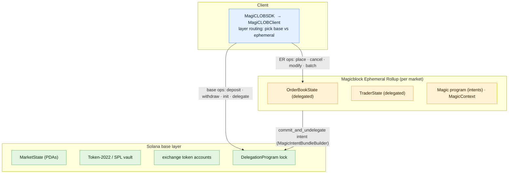

# MagiCLOB Architecture

## Overview

MagiCLOB is a price-time priority Central Limit Order Book deployed as a single
Anchor program on Solana and executed on Magicblock Ephemeral Rollups (ER).

The system splits responsibility across two layers:

- **Base layer (Solana)** owns custody, configuration, and the delegation
  lifecycle. Deposits, withdrawals, market initialization, trader
  registration, and session delegation all run here.
- **Ephemeral Rollup (Magicblock)** owns the live order book and trader
  sessions. Order placement, matching, cancellation, and modification run
  against delegated state at ER latency, then settle back to Solana via a
  commit + undelegate intent.



The program id is `DSMktdhdDAGgittEg88wqrh2AJmNq6oj2YDnNnmeKeQe` (local, devnet,
and mainnet). It is built with Anchor `1.1.2` and
`ephemeral-rollups-sdk` `0.17.0` (`features = ["anchor", "vrf"]`).

## Module layout

```text
contracts/programs/magiclob/src/
  lib.rs                        anchor entry point; #[ephemeral] program module
  errors.rs                     MagiCLOBError codes (Anchor: 6000..)
  fees.rs                       fee router (u128 math, bps)
  engine/                       pure matching logic, no Solana I/O
    mod.rs
    matcher.rs                  execute(), rest_order(), deltas, settle
    order_types.rs              OrderNode, MatchReport, TIF/STP enums, caps
    price_level.rs              depth/level aggregation over the book
  instructions/                 14 handler modules (see table below)
  state/
    market.rs                   MarketState + MarketStatus
    order_book.rs               OrderBookState slot pools
    trader.rs                   TraderState + TraderStatus
    vault.rs                    VaultState (custody ledger)
    staking.rs                  StakeInfo
    governance.rs               Proposal + ProposalStatus
    flash_loan.rs               FlashLoan (hot potato)
    mod.rs                      PDA seeds and per-type PDA derivations
```

All on-chain arithmetic on the book and balances is checked; `overflow-checks`
is enabled in the release profile.

## Account model

All core accounts are PDAs of the magiCLOB program. `_reserved`/bump fields are
not listed.

| PDA seeds `[program]`                                                                 | Type            | Role                                                                                 |
| ------------------------------------------------------------------------------------- | --------------- | ------------------------------------------------------------------------------------ |
| `[b"market", base_mint, quote_mint]`                                                   | `MarketState`   | Config, status, epoch, fee ledger (`accumulated_fees`, `accumulated_integrator_fees`) |
| `[b"order_book", market]`                                                              | `OrderBookState`| Bid/ask slot pools; delegated to the ER for the whole session                         |
| `[b"trader", market, owner]`                                                           | `TraderState`   | Per-(market, owner) internal ledger; delegated to the ER for the session              |
| `[b"vault", market]`                                                                   | `VaultState`    | Settlement obligations (`settled_*` / `owed_*`); base-layer custody ledger            |
| `[b"vault", market, b"base"]`, `[b"vault", market, b"quote"]`                          | SPL TokenAccount| VaultState-PDA-owned custody accounts holding the actual base/quote tokens (SPL owner = `[b"vault", market]`, not the program ID) |
| `[b"stake", market, owner]`                                                            | `StakeInfo`     | Staked quote tokens, epoch lockup                                                     |
| `[b"proposal", market, id_le_u64]`                                                     | `Proposal`      | Fee-change governance proposal, stake-weighted votes                                  |
| `[b"flash_loan", market, borrower, asset_u8]`                                          | `FlashLoan`     | Hot potato tracking an outstanding flash loan and its fee                             |

### Delegation-program PDAs

Each account delegated into an ER session requires three side accounts created
by the `#[delegate]` macro (SDK `delegationAccountsFor`):

| PDA                                                                       | Owner program | Purpose                                   |
| ------------------------------------------------------------------------- | ------------- | ----------------------------------------- |
| `[b"buffer", <delegated>]`                                                 | magiCLOB      | Pre-delegation snapshot of the account    |
| `[b"delegation", <delegated>]`                                             | Delegation Program (`DELeGGvXpWV2fqJUhqcF5ZSYMS4JTLjteaAMARRSaeSh`) | Delegation record (lock) |
| `[b"delegation-metadata", <delegated>]`                                    | Delegation Program | Delegation metadata                   |

While a session is live the delegated accounts are owned by the Delegation
Program on the base layer; their live state exists only on the ER.

### Custody model

Tokens are custodied in SPL token accounts owned by the `VaultState` PDA
(`[b"vault", market]`, not the program ID), created at the
(`[b"vault", market, base/quote]`) PDAs. `TraderState` keeps an internal ledger
(`base_balance` / `quote_balance`); entitlement is tracked separately as
`deposited_base` / `deposited_quote`.

`VaultState` records outstanding settlement obligations so flash loans and
withdrawals never touch the book:

- `settled_base` / `settled_quote` - outgoing liability (pool owes traders).
- `owed_base` / `owed_quote` - incoming receivable (traders owe the pool).

Notes on the current MVP:

- Matches settle by updating `TraderState` deltas only; `VaultState` is not
  written on the trading path.
- `vault_base_balance` / `vault_quote_balance` are initialized to zero and
  currently read only by the flash-loan capacity check; the SPL token accounts
  are the custody source of truth.
- The program does not create the two vault token accounts in
  `initialize_market`. `initialize_vault_accounts` creates them lazily: a
  permissionless, idempotent instruction that derives each account by its
  canonical PDA (`[b"vault", market, b"base"]` / `[b"vault", market,
  b"quote"]`), funds rent from the caller, and sets the SPL owner to the
  `VaultState` PDA `[b"vault", market]` to satisfy the
  `deposit`/`withdraw` constraints. Rerunning it
  after creation is a verified no-op (mint, owner, and token program rechecked),
  so it can be sent unconditionally before the first deposit.

## ER session and delegation lifecycle

1. `initialize_market` creates `MarketState`, `OrderBookState`, `VaultState`.
2. `register_trader` creates `TraderState` for `(market, owner)`.
3. `initialize_vault_accounts` (idempotent) creates the two
   `VaultState`-PDA-owned vault token accounts; any active-market signer may
   pay the rent.
4. `deposit` moves SPL tokens into the vault token accounts and credits the
   trader's deposited entitlement.
5. `delegate_trader_session` (base layer) delegates **both** the trader's
   `TraderState` and the market's shared `OrderBookState` to an ER. The trader
   owner signs; the payer may be a separate sponsor. An optional
   `remaining_accounts[0]` pins the ER validator identity.
6. Trading instructions (`place_limit_order`, `place_market_order`,
   `cancel_order`, `modify_order`, `bulk_batch_orders`) run on the ER against
   the delegated book and trader.
7. `settle_and_undelegate` (ER) snapshots the book, serializes the mutated
   accounts, and issues `MagicIntentBundleBuilder::commit_and_undelegate`,
   atomically committing the state to the base layer and releasing the
   Delegation Program lock.
8. Base-layer state is final once the commit lands; only then is settlement
   treated as final.

`trader.status` transitions `Active -> Delegated` on step 5 and is released
during step 7. Delegation does not replace application authorization - signer
and PDA constraints still apply to every instruction.

## Session model: one shared book per market

The `OrderBookState` is **market-wide shared state**, not per-trader. Delegating
it locks the entire market's book into one ER session:

- Only **one active session per market at a time** - a delegated account cannot
  be delegated again until it is undelegated, so the book serializes sessions.
- Membership today is **exactly one trader**: `delegate_trader_session` pairs
  one `TraderState` with the shared book. While the session is open, every other
  writer of the market must route to the same ER endpoint (resolved via the
  Magic Router and optionally pinned by `validator` in `DelegateConfig`).
- `trader.status = Delegated` marks session membership; the book itself carries
  no membership flag because its lock is enforced by the Delegation Program.

### Maker settlement requires session membership

On the ER, **only delegated accounts can be changed** (every Solana account is
readable; nothing else is writable). Matching produces maker deltas against
`TraderState` PDAs passed in `remaining_accounts` - a maker whose `TraderState`
is *not* in the session cannot be settled from ER execution, so the instruction
reverts (all-or-nothing).

This is a known limitation of the current single-trader session:

- **Group sessions** - extend delegation so every maker who rests liquidity
  delegates their `TraderState` to the same ER validator, or
- **Settlement queue** - record maker credits in a queue on the book during the
  session and let makers redeem them on the base layer after undelegation.

## Resting-order continuity across sessions

Resting GTC orders live in the book, not in per-trader state, so they survive
`settle_and_undelegate` and are picked up by the next session:

- `settle_and_undelegate` serializes the book (with every resting order and its
  `qty_remaining`, `filled_quantity`, and `sequence`) before committing; the
  committed base-layer book is the source for the next delegation.
- **Identity** is `(owner, client_order_id)` - cancels and reduction-only
  modifies are deterministic regardless of when a session closed.
- **Expiry is wall-clock** (Unix seconds, checked against `Clock`): an order
  that expired mid-session is popped lazily on the next header access and never
  resurrects after a commit.
- **Validator changes** re-delegate the *last committed* book. Any state
  modified in the current session must be committed (or committed-and-
  undelegated) before switching validators, or its matches are lost.
- IOC, FOK, and market-shaped orders never rest, so continuity concerns only
  cover GTC order flow.

## Commit economics

Sessions pay for commits in two ways (MagicBlock pricing, see `MAGICBLOCK.md`
§9):

- **Deposit-based:** a deposit at delegation covers session (300,000 lamports)
  and commit charges (100,000 lamports each after the first), settled at
  undelegation with the remainder refunded to the recorded `rent_payer`.
- **10-commit cap:** without a delegated fee payer, an account can commit 10
  times; commit 11 fails with `0xA0000000`. The final
  `commit_and_undelegate` is always accepted, so an account is never trapped -
  but a long-lived session must not rely on more than ~10 match-commits.
- **Delegated fee payer + `magic_fee_vault`:** removes the hard stop. Commits
  1-25 have no live fee; commit 26 and later cost 100,000 lamports per
  committed account, taken immediately from the delegated fee payer. This is
  the recommended path for sessions that outlive a handful of commits, and
  pairs with `MagicIntentBundleBuilder::magic_fee_vault(...)`.
- **Magic Actions:** `add_post_commit_actions` runs post-commit callbacks
  (e.g. atomic payouts) in the same intent, priced on requested compute units
  plus a 5,000-lamport callback fee drawn from the delegated fee payer.
- **Top-ups** use `lamportsDelegatedTransferIx` on the **base layer** (never the
  ER) with a fresh salt per transfer (`derivedLamportsPda`).

## Privacy: public ER vs PER/TEE

The current program runs on the **public** ER path:

- While a session is live, the book and fills are hidden from public searchers
  and mempool watchers - but the ER operator/validator and the client of record
  can observe the flow. This is *reduced* MEV exposure, not a proof of its
  absence.
- **Confidential trading requires a PER/TEE** deployment: Intel TDX with
  token-gated ingress (`EphemeralPermission` member flags) and attestation
  (`verifyTeeRpcIntegrity`), deployed to a `mainnet-tee`/`devnet-tee` endpoint.
  Even inside a TEE the enclave operator can read execution; privacy reduces
  linkability rather than eliminating it.
- PER wiring (permission accounts, token-gated endpoint, attestation policy) is
  a separate integration on top of the current `#[ephemeral]` program, not a
  configuration flag.

## Instruction set and routing

| Instruction            | Accounts                              | Layer        | Purpose                                    |
| ---------------------- | ------------------------------------- | ------------ | ------------------------------------------ |
| `initialize_market`    | authority, market, order_book, vault  | base         | Create market/book/vault PDAs              |
| `register_trader`      | payer, market, trader, owner          | base         | Create a `TraderState`                     |
| `initialize_vault_accounts` | rent_payer, market, mints, vault token PDAs | base | Idempotently create the VaultState-PDA-owned custody token accounts |
| `deposit`              | authority, vault, trader, token accts | base         | Move SPL tokens into pool vault            |
| `withdraw`             | authority, vault, trader, token accts | base         | Move SPL tokens out of pool vault          |
| `delegate_trader_session` | payer, market, trader (del), order_book (del), owner | base | Open an ER session                |
| `place_limit_order`    | TradeCtx: market, order_book, trader, owner | ER (base fallback) | Limit order with TIF/STP     |
| `place_market_order`   | TradeCtx                              | ER (base fallback) | Aggressive sweep, no resting    |
| `cancel_order`         | TradeCtx                              | ER (base fallback) | Cancel by owner + client order id |
| `modify_order`         | owner, market, order_book, trader     | ER (base fallback) | Reduce quantity in place (same price) |
| `bulk_batch_orders`    | TradeCtx                              | ER (base fallback) | Atomic batch, max `MAX_BATCH_SIZE` |
| `settle_and_undelegate`| payer, market, order_book, trader, owner, magic_program, magic_context | ER | Commit + release delegation |
| `stake` / `unstake` / `claim_rebates` | authority, market, stake_info, trader, token accts | base | DEEP staking + rebates |
| `submit_proposal` / `vote` / `execute_proposal` | market, proposal, stake_info | base | Fee governance |
| `borrow_flashloan_base` / `_quote` / `return_flashloan_*` | market, vault, trader, token accts | base | Uncapped flash loans (hot potato) |

TradeCtx = `[market (mut), order_book (mut), trader (mut), owner (signer)]`,
plus maker `TraderState` PDAs in `remaining_accounts` (exact set required).

## Key constants

From `engine/order_types.rs` and the SDK:

- `MAX_ORDERS_PER_SIDE = 13` - fixed per-side book capacity (see
  `Matching Engine`).
- `MAX_BATCH_SIZE = 16` - maximum elements in one `bulk_batch_orders` call.
- `NONE_IDX = u16::MAX` - linked-list sentinel.
- `NO_EXPIRY = u64::MAX` - "never expires" sentinel (SDK default for
  `expireTimestamp`).

## Layer-routing rules

- Custody and session-setup instructions always run on the **base layer**.
- Trading instructions default to the **ER** when an ER endpoint is configured
  and the trader is inside a session, otherwise to the base layer.
- Reads of the book default to the **ER** while a session is open, because the
  base layer holds a stale snapshot of delegated accounts.

## Deployment prerequisites and known gaps

- The vault base/quote token accounts must exist (owned by the `VaultState`
  PDA, correct mints) before the first deposit; `initialize_market` does not
  create them.
  Call the permissionless, idempotent `initialize_vault_accounts` (with any
  rent payer) to create them lazily, then `deposit` into them.
- Segmented/book page-out is a planned scalability task: order-book capacity is
  currently bounded per side (release-blocking for high-capacity markets).
- `epoch_maker_fees_paid` is tracked per `TraderState` for rebate accounting
  and reset/advanced with the market epoch.

See `Matching Engine`, `Security Model`, `Threat Model`, and `Invariants` for
the behavior contracts that keep the system correct.