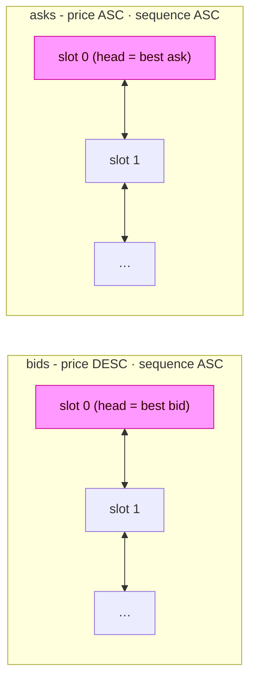

# MagiCLOB Matching Engine

## Overview

The engine is pure logic in `engine/` - it does no Solana I/O and is unit-tested
directly (`engine/matcher.rs`). This makes matching deterministic and
reproducible inside the Ephemeral Rollup.

Terms:

- **Aggressive / taker** - the order being executed by the current instruction.
- **Resting / maker** - orders already on the book.

## Data structure: fixed-capacity slot pools

The book (`OrderBookState`) is a pair of fixed-size arrays - `bids` and `asks` -
of `OrderNode` (`MAX_ORDERS_PER_SIDE` each). Each side is a doubly-linked list
keyed by `(price, sequence)`:



Each side keeps a free-stack (`bid_free` / `ask_free`) and a high-water mark
(`bid_count` / `ask_count`). Slots are recycled on pop/cancel so the arrays
never grow and there is **no heap allocation** on the hot path.

`MAX_ORDERS_PER_SIDE = 13` is bounded by the 4096-byte SBF stack frame: each
`Account<OrderBookState>` deserialization builds the struct on the stack, so
`discriminator + header + 2 * 13 * OrderNode::borsh_size()` must stay under
~4 KiB. Raising capacity requires moving the pools behind `#[account(zero_copy)]`
/ `AccountLoader`.

`NONE_IDX = u16::MAX` is the linked-list sentinel.

## Priority ordering

- **Price:** bids sort price-descending, asks price-ascending, so the head of
  each side is always the best executable price.
- **Time:** a global per-book counter (`order_sequence`) issues monotonic
  sequence numbers; at equal price, ascending sequence wins (FIFO).

Insertion (`rest_order`) walks from the head until it finds the first node that
is *strictly worse* than the new order; equal-price nodes are walked past, so a
new order lands after every earlier order at the same price, then it is linked
`before` the first worse node. A newly placed order that is better than the
whole list becomes the head.

## Order lifecycle fields

`OrderNode` records an optional `expire_timestamp` (Unix **seconds**). The engine
rejects an incoming order when `clock_timestamp > expire_timestamp`
(`OrderExpired`) and silently pops expired resting makers during a sweep.

## `TimeInForce` and self-trade prevention

Wire values are `u8` in the RPC interface; the SDK maps them to enums:

| TimeInForce        | u8 | Behavior                                                       |
| ------------------ | -- | -------------------------------------------------------------- |
| `GoodTillCancelled`| 0  | Unfilled remainder rests on the book.                          |
| `ImmediateOrCancel`| 1  | Unfilled remainder is discarded.                               |
| `FillOrKill`       | 2  | Unless fully filled, the whole instruction reverts.            |
| `PostOnly`         | 3  | Rejected outright if it would cross the book.                  |

| SelfMatchingOption | u8 | Behavior on a self-trade (taker and maker share `owner`)       |
| ------------------ | -- | -------------------------------------------------------------- |
| `Allowed`          | 0  | Trade with yourself.                                           |
| `CancelTaker`      | 1  | Stop the sweep; leftover follows the TIF path.                 |
| `CancelMaker`      | 2  | Pop the self-order off the opposite side and keep sweeping.    |

For the MVP only GTC orders rest (`place_limit_order` only emits `OrderPlaced`
for a GTC leftover). Market-shaped orders never rest.

## Execution algorithm (`execute`)

Per aggressive order:

1. **Validate:** quantity nonzero, and for limit orders price nonzero; the
   market checks (`min_size`, `lot_size`, `tick_size`, `integrator_fee_bps_cap`,
   expiry) are enforced in the instruction wrappers before `execute`.
2. **PostOnly guard:** a PostOnly taker with `is_market == false` is rejected
   with `PostOnlyWouldCross` if the head of the opposite side already crosses
   the proposed price.
3. **Sweep loop** over the opposite side's head:
   - Skip expired makers (`pop_head`, `report.order_expired = true`).
   - Stop when the price no longer crosses: `bid >= ask` matches.
   - Apply self-trade prevention (above).
   - `fill_qty = min(remaining, node.qty_remaining)`; compute `notional` in
     `u128`; compute taker fee, maker fee, and integrator fee in bps.
   - Accumulate `TakerDelta` / `MakerDeltas` and update
     `market.accumulated_fees` / `accumulated_integrator_fees`.
   - Fully filled makers are popped; partially filled makers are updated
     in place (`qty_remaining -= fill_qty`, `filled_quantity += fill_qty`).
4. **Uncovered remainder:**
   - FOK -> revert `FillOrKillNotFilled` (whole transaction rolls back).
   - IOC -> reported as `remaining_base`.
   - GTC / PostOnly limit -> `rest_order` (PostOnly already cannot cross, so
     it only ever rests); market remainder is **discarded**, never rests.
5. `avg_fill_price = total_quote_filled / total_base_filled`.

All fills, fees, and balance deltas are accumulated into a `MatchReport`
(returned) and two delta sets:

- `TakerDelta` - the net `base_delta` / `quote_delta` for the aggressive trader.
- `MakerDeltas` - one `MakerDelta` per resting owner (coalesced per owner).

The engine does **not** write balances. `execute` returns the deltas; the
instruction layer applies them atomically.

## Fees (`fees.rs`)

All fees are denominated in quote and expressed in basis points (1/10000):

- **Taker fee** - paid by the aggressive order (`market.current_taker_fee_bps`).
- **Maker fee** - paid by the resting order (`market.current_maker_fee_bps`),
  reduced by the market `maker_rebate_bps` rebate when positive.
- **Integrator fee** - paid by the taker, credited to the *resting* order's
  integrator, capped per fill by `market.integrator_fee_bps_cap`.

`fee_amount(notional, fee_bps) = notional * fee_bps / 10_000`, computed in
`u128` so `u64::MAX @ 10_000 bps` cannot overflow; the division is exact by
invariant. `split_integrator_fee` is lossless - any remainder stays with the
protocol.

## Settlement

`settle` (called by every trading instruction) commits deltas atomically:

1. Apply `TakerDelta` to the taker's `TraderState`; a negative resulting
   balance reverts `InsufficientBalance`.
2. `apply_maker_deltas` requires the maker accounts in `remaining_accounts` to
   be an **exact** set: every non-taker maker delta must have exactly one
   matching `TraderState` PDA passed in. Missing, extra, or duplicate maker
   accounts revert (`MakerAccountMissing`, `UnexpectedMakerAccount`,
   `DuplicateMakerAccount`). The taker's own deltas never come through
   `remaining_accounts`.
3. Maker `epoch_maker_fees_paid` is accumulated for rebate accounting.

All-or-nothing: any failure - insufficient balance, overflow, wrong maker set -
reverts the whole instruction, including batch elements.

## Cancellation and modification

- `cancel_order(book, side, owner, client_order_id)` unlinks and frees the first
  matching slot in **book order** - matching on identity, not position.
- `modify_order` is reduction-only and price-preserving:
  - `new_quantity < qty_remaining + filled_quantity` (can't grow the order),
  - `new_quantity > filled_quantity` (remainder stays positive),
  - `new_price == 0 || new_price == price` (price changes forfeit separate
    cancel-and-replace), and
  - quantity still respects `min_size` / `lot_size`.
  Changing price therefore never steals queue position (`InvalidModifyPrice`).

## Capacity and batch limits

- `MAX_ORDERS_PER_SIDE = 13` - the entire book fits the SBF stack frame; a full
  side rejects further rests with `BookCapacityReached`.
- `MAX_BATCH_SIZE = 16` - `bulk_batch_orders` reverts with `BatchTooLarge`
  beyond this. Every element runs `execute` (market if `price == 0`) and can
  reference different maker sets; all elements share one `TradeCtx`.

## Depth / level aggregation (`price_level.rs`)

`levels(book, side)` walks the linked list and collapses consecutive equal-price
nodes into `PriceLevel { price, total_qty, order_count, head_slot }`, best
first. `top_of_book` returns best bid/ask plus top-level sizes. These helpers
back the SDK's `getDepth` / `getTopOfBook` and the `SessionSettled` snapshot.

## Events

- `OrderFilled` - per aggressive order, embeds the full `MatchReport`
  (per-fill breakdown: price, qty, maker, maker fee).
- `OrderPlaced` - emitted for a GTC remainder that rests.
- `OrderCancelled`, `OrderModified`.
- `SessionSettled` - top-of-book and depth summary before undelegation.
- `DepositEvent`, `WithdrawEvent`, `FlashLoanEvent`.

## Testing

The engine ships unit tests covering FIFO breakage, ask-sweep by a bid,
limit remainder resting mid-book, market sweep with no rest, cancel identity,
slot recycling, insufficient balance, and capacity failure. Run with:

```bash
cargo test --manifest-path magiclob/Cargo.toml --lib
```